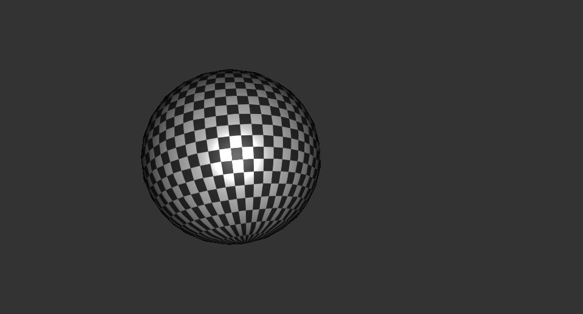

# [Tellusim Core SDK Tests](https://tellusim.com/core-sdk/)

C++, C#, Rust, Python, Swift, Java, Kotlin

Direct3D12, Direct3D11, Metal, Vulkan, OpenGL, OpenGLES, WebGL, WebGPU

Windows, Linux, macOS, Android, iOS, Web

https://tellusim.com/

---

## Clustered Lights

Forward shading with 16384 dynamic lights. This algorithm is compatible with deferred shading and transparent objects.

https://github.com/Tellusim/Tests/tree/main/graphics/lights/

## Meshlet Render

A massive meshlets rendering example with Mesh Shader for hardware and Compute Shader for software rasterization.

https://github.com/Tellusim/Tests/tree/main/graphics/meshlet/

## Mesh RayTracing

Traversal class for the simple raytracing pipeline access. Vulkan or Direct3D12 API is required.

https://github.com/Tellusim/Tests/tree/main/graphics/traversal/

## Mesh Tracing

Ray Query raytracing of animated scene. Vulkan, Direct3D12, or Metal API is required.

https://github.com/Tellusim/Tests/tree/main/graphics/tracing/

## Separable Filter

The SeparableFilter interface helps to create different separable filters like Gaussian, Sobel, Box, and custom weights.

https://github.com/Tellusim/Tests/tree/main/graphics/separable_filter/

## Geometry Tessellation

Quadrilateral tessellation with Control + Evaluate or Mesh Shaders.

https://github.com/Tellusim/Tests/tree/main/graphics/tessellation/

## Ordered Independent Transparency

Ordered Independent Transparency with atomic buffer operations from the fragment shader.

https://github.com/Tellusim/Tests/tree/main/graphics/transparency/

## Hardware Ray Tracing Shadows

Hardware raytracing shadows with simple deferred shading. An API with Ray Query support is required.

https://github.com/Tellusim/Tests/tree/main/graphics/shadow_tracing/

## Software Ray Tracing Shadows

Software raytracing shadows with simple deferred shading. Compatible with all APIs.

https://github.com/Tellusim/Tests/tree/main/graphics/shadow_tree/

## Percentage Closer Filtering Shadow Map

PCF Shadow Maps provides shadow with variable penumbra size based on the distance between the shadow caster and receiver.

https://github.com/Tellusim/Tests/tree/main/graphics/shadow_pcf/

## Exponential Shadow Maps

Exponential Shadow Maps provides noise-free shadows with a fixed performance cost and constant penumbra size.

https://github.com/Tellusim/Tests/tree/main/graphics/shadow_esm/

## Parallax 2D

Parallax occlusion mapping with self-shadowing for the mesh geometry.

https://github.com/Tellusim/Tests/tree/main/graphics/parallax_2d/

## Parallax Cube

Parallax occlusion mapping with self-shadowing for the analytical sphere.

https://github.com/Tellusim/Tests/tree/main/graphics/parallax_cube/

## Mesh Tangent Basis

Mesh tangent basis renormalization at the Fragment Shader. Mesh class can re-create normal and tangent vectors.

https://github.com/Tellusim/Tests/tree/main/graphics/tangent/

## Mesh Model

MeshModel class creates a rendering model representation for the input Mesh or MeshGeometry with a specified Pipeline layout.

https://github.com/Tellusim/Tests/tree/main/graphics/model/

## Mesh Skinned

This is a basic skinned mesh animation example. Mesh classes give comprehensive access to all mesh data, including Nodes, Animations, Materials, Cameras, and Lights.

https://github.com/Tellusim/Tests/tree/main/graphics/skinned/

## Line Rendering

Simple antialiased line rendering. The Vertex shader creates a screen-aligned billboard, and the fragment shader calculates the distance to the line.

https://github.com/Tellusim/Tests/tree/main/graphics/line/

## Texture Compression

Real-time BC1-BC7 texture encoder using compute shader.

https://github.com/Tellusim/Tests/tree/main/graphics/encoder/

---

## Mesh Reduce

MeshReduce is a simple way to simplify input mesh geometry. Simplification preserves all Mesh Attributes, and it is compatible with Skinning Animation.

https://github.com/Tellusim/Tests/tree/main/geometry/reduce/

## Mesh Refine

MeshRefine refines geometry mesh using Catmull-Clark (for quadrilaterals) or Loop (for triangles) subdivision algorithms. The Crease Attribute allows additional control over the subdivision process.

https://github.com/Tellusim/Tests/tree/main/geometry/refine/

---

## Parallel TensorGraph from PyTorch

Simple convolutional autoencoder trained with PyTorch and imported into TensorGraph.

https://github.com/Tellusim/Tests/tree/main/parallel/tensor_torch/

## Parallel TensorGraph MNIST Digits Recognition

MNIST Digits Recognition using TensorGraph with PyTorch model.

https://github.com/Tellusim/Tests/tree/main/parallel/tensor_mnist/

## Parallel Fluid 2D

Simple 2D fluid simulation based on Fast Fourier Transformation.

https://github.com/Tellusim/Tests/tree/main/parallel/fluid_2d/

## Parallel Radix Sort

Multiple independent sorting algorithms can be dispatched in parallel. There is no overhead in comparision with the single array sort. Additionally, dispatch parameters can be fetched from the indirect buffer.

https://github.com/Tellusim/Tests/tree/main/parallel/radix_sort/

## Parallel Spatial Grid

Simple physics simulation with collisions based on the SpatialGrid class. It is the fastest way to collide objects of the same size.

https://github.com/Tellusim/Tests/tree/main/parallel/spatial_grid/

## Parallel Spatial Tree

Simple physics simulation with collisions based on the SpatialTree class. The SpatialTree allows collision and intersection tests with any primitive inside BVH.

https://github.com/Tellusim/Tests/tree/main/parallel/spatial_tree/

---

## Interface Canvas

Different CanvasElement classes, including texture filtration, gradients, contour outlines, and SVG rendering.

https://github.com/Tellusim/Tests/tree/main/interface/canvas/

## Interface Controls

Different User Interface Control classes in resolution-independent configuration.

https://github.com/Tellusim/Tests/tree/main/interface/controls/

## Interface Layer

A transparent multilayer Controls with variable background blur.

https://github.com/Tellusim/Tests/tree/main/interface/layer/

## SVG Image

Simple SVG image loading and rendering. CanvasShape class accepts SVG path string as input data.

https://github.com/Tellusim/Tests/tree/main/interface/svg/

## Custom Control

Custom Controls can be created by simple ControlBase class inheritance. The Control behavior can be completely overridden.

https://github.com/Tellusim/Tests/tree/main/interface/control/

---

## Platform Precision

Performance and precision difference between 16-bit, 32-bit, and 64-bit floating formats.

https://github.com/Tellusim/Tests/tree/main/platform/precision/

## Platform Bindless

TextureTable is an interface for an unlimited number of bindless textures that can be accessed from any shader by uniform or non-uniform index. Vulkan or Direct3D12 API is required.

https://github.com/Tellusim/Tests/tree/main/platform/table/

## Platform Texel

Texel buffer provides cached buffer access that is compatible with OpenGLES platform. Moreover, it can work faster than the Storage buffer in some scenarios.

https://github.com/Tellusim/Tests/tree/main/platform/texel/

## Platform Texture

Dynamic 3D texture created with SIMD CPU instructions.

https://github.com/Tellusim/Tests/tree/main/platform/texture/

## Platform Command

Command class for basic rendering. Depth Cube texture for omnidirectional shadow map.

https://github.com/Tellusim/Tests/tree/main/platform/command/

## Platform Tracing

Hardware accelerated raytracing shadows. An API with Ray Query support is required.

https://github.com/Tellusim/Tests/tree/main/platform/tracing/

## Platform Compute

Compute class for simple compute shader texture generation.

https://github.com/Tellusim/Tests/tree/main/platform/compute/

## Platform Fence

Multi-GPU N-body simulation with Fence synchronization. A shared buffer is used for data exchange between GPUs.

https://github.com/Tellusim/Tests/tree/main/platform/fence/

## Platform Dynamic

A single-thread dynamic geometry rendering can provide more than 100M triangles per second rate.

https://github.com/Tellusim/Tests/tree/main/platform/dynamic/

## Platform Clip Planes

Vertex Shader clip distance output is useful for arbitrary geometry culling.

https://github.com/Tellusim/Tests/tree/main/platform/clipping/

## Platform Stencil Buffer

Constructive Solid Geometry with the Stencil Buffer. This algorithm is compatible with procedural geometry.

https://github.com/Tellusim/Tests/tree/main/platform/stencil/

## Platform Fusion

Fusion API allows replicating all commands and resources across multiple physical or logical devices. It dramatically simplifies the development of apps for multi-GPU or multi-channel rendering.

https://github.com/Tellusim/Tests/tree/main/platform/fusion/

## Platform Layers

Multilayer rendering with Layer specified by the Vertex Shader / Geometry Shader / Geometry Passthrough Shader.

https://github.com/Tellusim/Tests/tree/main/platform/layers/

## Barycentric Coordinates

Build-in barycentric coordinate input is available in Vulkan, Direct3D12, and Metal APIs.

https://github.com/Tellusim/Tests/tree/main/platform/barycentric/

## Platform Texture Samples

Writing and reading individual multisample texture samples with active Pipeline sample write mask.

https://github.com/Tellusim/Tests/tree/main/platform/samples/

## Conservative Rasterization

Hardware conservative rasterization.

https://github.com/Tellusim/Tests/tree/main/platform/conservative/

## Cooperative Matrix (Tensor Cores)

Cooperative matrix example.

https://github.com/Tellusim/Tests/tree/main/platform/cooperative/

## Matrix Multiplication

Matrix multiplication example.

https://github.com/Tellusim/Tests/tree/main/platform/matrix/

## Shader Printf

A simple preprocessor-based printf() functionality for compute shaders that work with all APIs.

https://github.com/Tellusim/Tests/tree/main/platform/printf/

